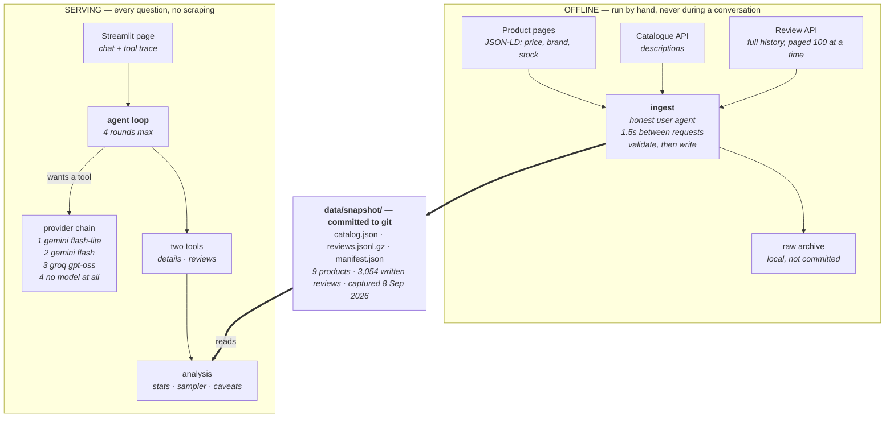
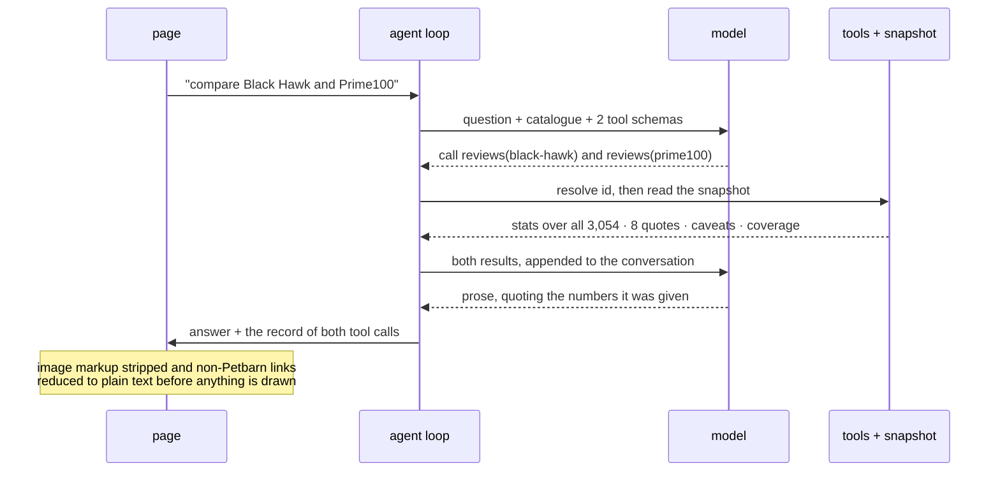

# Architecture

Two diagrams: where the data lives, and what happens when somebody asks a question.

## The system

Everything slow, rate-limited or liable to fail happens offline and produces a snapshot.
Everything a visitor touches reads that snapshot.

The snapshot is the seam. Nothing below it can fail in a way a visitor would see, except the
model, and that has three fallbacks — the last of which is not a model.

## One question, end to end

A comparison takes three model calls and two tool calls, in about five seconds.

**The arrows matter more than the boxes.** Everything numeric travels back from the tools already
computed. If the model calculated anything itself, those arrows would carry raw review text
instead, and every figure in the answer would be an estimate nobody could check. Moving that work
to the left of the model is the whole design.

## Why the pieces are where they are

**The tools do the arithmetic.** A model asked how many people complained about price will produce
a number that sounds right, and a reader cannot tell it from one that is right. Computing it in
Python makes that impossible rather than unlikely. It also means a small, fast model is enough.

**Reviews come from a snapshot.** The review API returns a hundred reviews per call, and 96% of
this catalogue is four and five stars, so a live fetch would return almost nothing critical. Paging
the whole history once, offline, is what lets the tool go looking for the rare complaints.

**The chain ends in no model.** The failure worth defending against is not an outage but a mistyped
key or a rate limit, which look identical to a visitor because the host hides error detail. The
last rung resolves the question against the catalogue itself and renders the underlying data.

**Untrusted text is cleaned twice.** Once at ingest, where review bodies are normalised and
suspicious content is flagged, and once at display, because the model composes its answer from that
text and what it writes is not what the tool returned.
